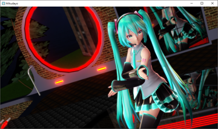
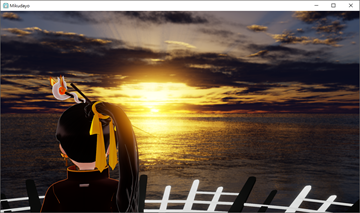
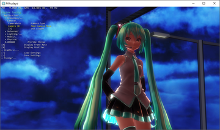
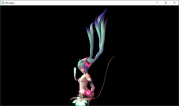

MIKU.VIEWER
===========

### MikuMikuDance(MMD) Viewer ##

## Club Majestic

- ORIGINAL: [クラブ=マジェスティ](https://www.youtube.com/watch?v=Zh3CS6xtS3A)

### Features
- Model importer (PMX, X)
- Keyframe based Animation (VMD)
- Rigid body physics (Bullet)
- Inverse IK (CCD)
- Shadow Map (LiSPSM)
- Skinning (LB, DQB)
- AA (MSAA, SMAA, FXAA)
- HDR
- Bloom

### Effects
- Auto Luminous4
- Diffusion7
- 多光源エフェクト
- Mirror
- Full

### DIRECTX 11.1
- Ported from [MiniEngine](https://github.com/Microsoft/DirectX-Graphics-Samples/) DIRECTX 12

### DOWNLOAD
- \[[ClubMajestic.zip](https://raw.githubusercontent.com/newpolaris/Mikudayo/ClubMajestic/Achive/ClubMajestic.zip)\]. 

### References
* A sampling of shadow techniques \[[link](https://mynameismjp.wordpress.com/)\].
* Light Space Perspective Shadow Maps \[[link](https://www.cg.tuwien.ac.at/research/vr/lispsm/)\].
* MiniEngine \[[link](https://github.com/Microsoft/DirectX-Graphics-Samples/)\].
* Zerogram.info \[[link](http://zerogram.info)\].
* MMDAI \[[link](https://github.com/hkrn/MMDAI)\].
* MMD.js \[[link](https://github.com/edvakf/MMD.js)\].
* Ray \[[link](https://github.com/ray-cast/ray)\].